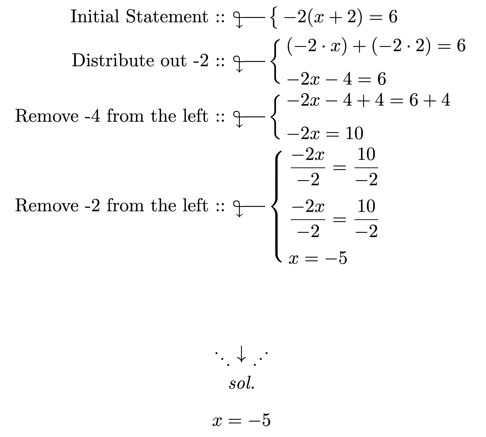

# explain-math

<div align="center">
  
  <p>🧮 A handy LaTeX package for writing readable and explained mathematics</p>
</div>

- [explain-math](#explain-math)
  - [🚀 Installation](#-installation)
  - [✨ Commands](#-commands)
    - [`\explain`](#explain)
    - [`\step`](#step)
    - [`\equation`](#equation)
    - [`\formula`](#formula)
    - [`\statement`](#statement)
    - [`\variables`](#variables)
    - [`\var`](#var)
    - [`\vart`](#vart)
    - [`\varu`](#varu)
    - [`\vartu`](#vartu)
    - [`\sol`](#sol)
    - [`\msol`](#msol)
    - [`\bexplain`](#bexplain)
    - [`\aexplain`](#aexplain)

## 🚀 Installation

Copy the [package file](explain-math.sty) to `/usr/local/texlive/texmf-local/tex/latex/local` on your machine. This can be accomplished with the following commands:

```bash
sudo cp explain-math.sty /usr/local/texlive/texmf-local/tex/latex/local
sudo texhash
```

If you need to uninstall just remove the file by running the following command:

```bash
sudo rm /usr/local/texlive/texmf-local/tex/latex/local/explain-math.sty
```

Once you have that you can just call the package:

```latex
\usepackage{explain-math}
```

## ✨ Commands

See an example of some commands in the [example PDF](example.pdf)

### `\explain`

Description: Explain some math

Required parent environment: `align` or `align*`

Parameters:

1. Explanation (normal mode)
2. Math (math mode)

Example:

```latex
\begin{align*}
    \explain{Here is some math}{2 + 2 = 4}
    \explain{Here is some multiline math}{
        \step{ 2 + 2 = 4 }
        \step{ 10 - 10 = 0 }
    }
\end{align*}
```

### `\step`

Description: A step inside the math section of the `\explain` environment

Required parent environment: None, but should be inside `\explain` arg #2

Parameters:

1. Math (math mode)

Example:

```latex
\begin{align*}
    \explain{Here is some multiline math}{
        \step{ 2 + 2 = 4 }
        \step{ 10 - 10 = 0 }
    }
\end{align*}
```

### `\equation`

Description: Initial equation

Required parent environment: `align` or `align*`

Parameters:

1. Equation (math mode)

Example:

```latex
\begin{align*}
    \equation{c^2 = a^2 + b^2}
\end{align*}
```

### `\formula`

Description: Initial formula

Required parent environment: `align` or `align*`

Parameters:

1. Formula (math mode)

Example:

```latex
\begin{align*}
    \formula{P = x + b}
\end{align*}
```

### `\statement`

Description: Initial math statement

Required parent environment: `align` or `align*`

Parameters:

1. Math statement (math mode)

Example:

```latex
\begin{align*}
    \statement{-2(x + 2) = 6}
\end{align*}
```

### `\variables`

Description: Define variables that should be plugged into a formula

Required parent environment: `align` or `align*`

Parameters:

1. Variables (math mode)

Example:

```latex
\begin{align*}
    \variables{a = 2}
    \varables{
        a = 10 \\
        b = 2 \\
        c = 10
    }
\end{align*}
```

### `\var`

Description: Variable declaration

Required parent environment: `align` or `align*`

Parameters:

1. Name (math mode)
2. Value (math mode)

```latex
\var{x}{10}
```

### `\vart`

Description: Variable declaration with name in text

Required parent environment: `align` or `align*`

Parameters:

1. Name (normal mode)
2. Value (math mode)

```latex
\vart{x}{10}
```

### `\varu`

Description: Variable declaration with unit

Required parent environment: `align` or `align*`

Parameters:

1. Name (math mode)
2. Value (math mode)
3. Unit (normal mode)

```latex
\varu{x}{10}{cm}
```

### `\vartu`

Description: Variable declaration with text and unit

Required parent environment: `align` or `align*`

Parameters:

1. Name (normal mode)
2. Value (math mode)
3. Unit (normal mode)

```latex
\vartu{x}{10}{cm}
```

### `\sol`

Description: Solution to a problem

Required parent environment: None

Parameters:

1. Solution (normal mode)

Example:

```latex
\sol{All real numbers}
```

### `\msol`

Description: Solution to a problem with math

Required parent environment: None

Parameters:

1. Solution (math mode)

Example:

```latex
\msol{x = 10}
```

### `\bexplain`

Description: Braced explanation below some math

Required parent environment: Math environment

Parameters:

1. Note (normal mode)
2. Math (math mode)

Example:

```latex
$ \bexplain{This isn't true}{2 + 2 = 0} $
```

### `\aexplain`

Description: Braced explanation above some math

Required parent environment: Math environment

Parameters:

1. Note (normal mode)
2. Math (math mode)

Example:

```latex
$ \aexplain{This is true}{2 + 2 = 4} $
```
